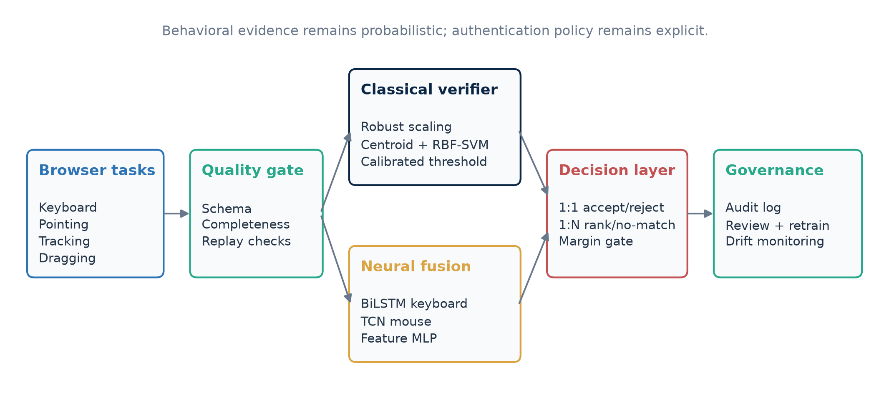
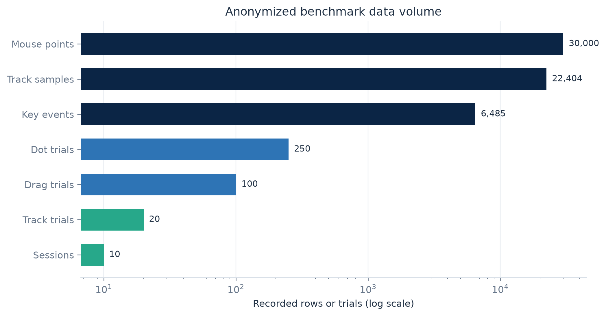
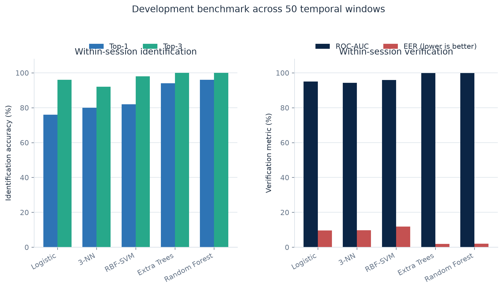
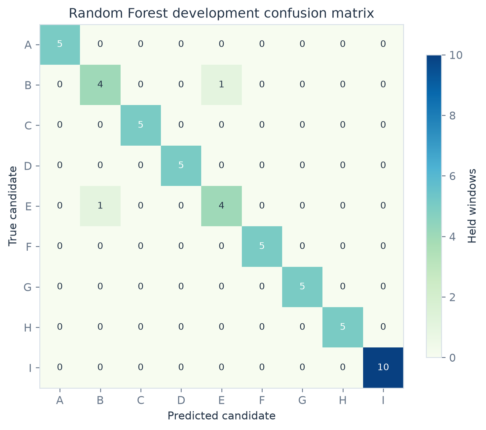
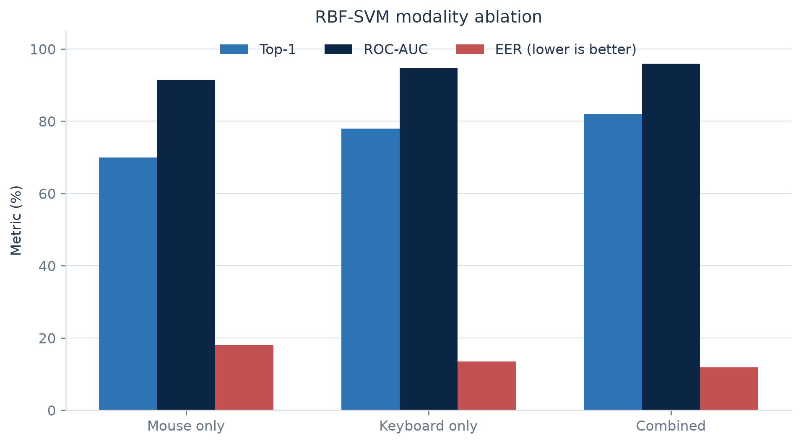
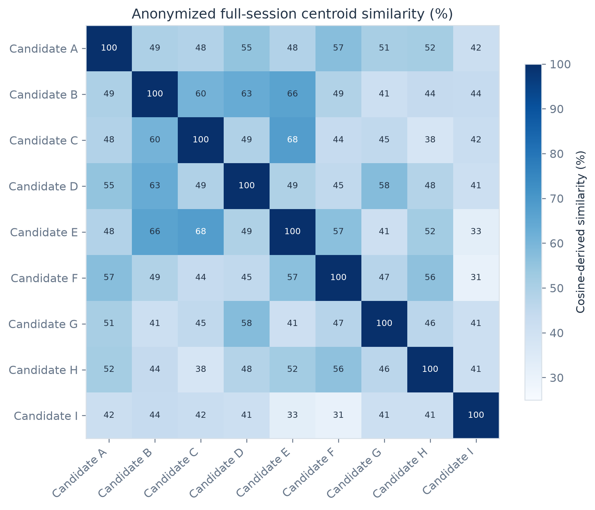
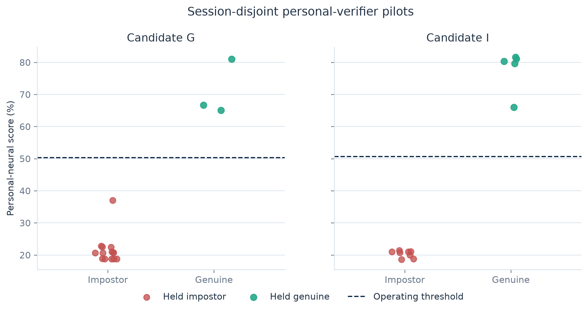

# BehaveGuard

## Multimodal Behavioral Authentication with Calibrated Classical Verification and Neural Sequence Modeling

**Technical white paper | Development evaluation | July 2026**

**Prepared by BehaveGuard Research & Engineering**

> **Publication status.** This document reports a development-stage system and a small exploratory dataset. Its benchmark results measure within-session separability, not cross-day or production authentication accuracy. BehaveGuard should be used as an additional risk signal, not as a standalone authenticator.

<!-- pagebreak -->

## Abstract

BehaveGuard is a browser-based behavioral-authentication system that combines keyboard timing, passive pointer movement, target acquisition, pursuit tracking, and dragging. It supports claimed-identity verification (1:1) and closed-candidate identification (1:N), while separating data collection, model training, threshold calibration, and administrative governance.

The system uses two complementary modeling paths. A deployable classical path combines robustly scaled profile centroids with an RBF support-vector machine (SVM), then applies an explicit acceptance threshold and a top-candidate margin. An advisory neural path fuses a bidirectional long short-term memory network (BiLSTM) for keyboard sequences, a temporal convolutional network (TCN) for pointer sequences, and a multilayer perceptron for engineered features. Neural checkpoints include their feature manifest, scaler, class vocabulary, temperature, and representation-format version.

The fixed benchmark contains 10 browser sessions from nine anonymized candidates and 50 non-overlapping temporal windows. Random Forest achieved 96% top-1 identification accuracy and 2.00% equal-error rate (EER); Extra Trees achieved 94% top-1 and 1.88% EER; the tuned RBF-SVM achieved 82% top-1, 0.9589 verification ROC-AUC, and 11.87% EER. A keyboard-plus-mouse SVM outperformed either modality alone. Two later target-specific neural pilots separated their limited held genuine and impostor trials without an observed error, but the trial counts are too small to estimate operational false-acceptance or false-rejection rates.

All candidates are represented as Candidate A through Candidate I. No participant name, alias, email address, account identifier, raw keystroke content, or reversible candidate map is included in this publication package. The paper emphasizes leakage controls, session-disjoint evaluation, privacy protection, uncertainty, and the data-collection work still required before deployment.

## Executive summary

Behavioral biometrics are probabilistic. NIST recognizes typing cadence, typing speed, mouse movement, and related signals as behavioral biometric characteristics, while also restricting biometrics to an activation factor within multi-factor authentication rather than a standalone authenticator [1]. BehaveGuard follows that risk posture.

The principal findings are:

1. **Multimodal collection is feasible in an ordinary browser.** The benchmark includes 6,485 key events, 30,000 passive pointer points, 250 target-click trials, 100 drag trials, and 22,404 pursuit samples.
2. **The current evidence is developmental.** Eight candidates have one benchmark session; Candidate I has two. Five windows from one parent session do not become five independent sessions.
3. **Classical models are the defensible deployment baseline.** Tree ensembles provide the strongest benchmark separation, while the RBF-SVM and centroid path offers a compact, inspectable online scorer.
4. **Fusion improves the tested SVM.** Keyboard-plus-mouse input improved top-1 accuracy to 82% and reduced EER to 11.87%, compared with 78%/13.50% for keyboard only and 70%/18.00% for mouse only.
5. **Neural output remains advisory.** The fixed-cohort fusion network reached 90% held-window accuracy, but a neural probability is not an identity guarantee. The production pipeline uses class balancing, early stopping, session-held validation, temperature scaling, and checkpoint compatibility checks.
6. **Thresholds must be evaluated, not guessed.** BehaveGuard now supports session-stratified calibration, identity-disjoint unknown probes, profile-specific thresholds when evidence permits, and a global fallback.
7. **Privacy and governance are part of the model.** Raw behavior is treated as biometric information; identification samples are separated from enrollment evidence; retraining is auditable; profiles can be restricted or removed; and public research artifacts are anonymized.

## 1. Problem definition and design objectives

### 1.1 Verification and identification

BehaveGuard addresses two related decisions:

- **1:1 verification:** Given a claimed profile and a newly collected session, determine whether the session is sufficiently consistent with the claimed profile.
- **1:N identification:** Given a new session and a bounded candidate set, rank candidates and return a match only when the leading score clears both an acceptance threshold and a minimum margin over the runner-up.

The distinction matters. In 1:1 verification, a score is compared with one claimed identity. In 1:N identification, the system must additionally control search-space effects, candidate ambiguity, and the possibility that the true person is absent. “Closest” is not equivalent to “accepted.”

### 1.2 Security posture

Behavior is affected by device, browser, physical condition, fatigue, injury, environment, task familiarity, and time. It may also be observed or replayed. Accordingly, BehaveGuard is designed as:

- an additional authentication or risk signal;
- a system that can return no-match or insufficient evidence;
- a model with explicit operating thresholds and audit records;
- a pipeline in which new probes do not silently become training data; and
- a research system whose uncertainty is stated alongside its results.

This posture is consistent with NIST guidance that biometric matching is probabilistic and that a false-match rate does not, by itself, establish authentication confidence or account for spoofing [1]. ISO/IEC 19795-1 likewise emphasizes test protocols, error-rate reporting, bias reduction, and the limits of applicability of biometric results [2].

## 2. Research and standards context

Keystroke dynamics has been studied as an authentication signal for decades. Monrose and Rubin demonstrated that timing features can support identity discrimination, while also showing the dependence of results on enrollment and operating conditions [4]. Killourhy and Maxion later highlighted a central methodological problem: detectors cannot be compared soundly when datasets and evaluation protocols differ; they published a repeatable benchmark using 51 people and 400 password repetitions per person [5].

Mouse dynamics provides a complementary behavioral channel. Shen and colleagues analyzed mouse operating styles for authentication using fine-grained movement behavior and one-class learning [6]. Mondal and Bours evaluated combined keystroke and mouse evidence in a continuous-authentication setting and emphasized that one modality should not create an avoidable blind spot when a user interacts mainly through the other [7]. A recent survey by Khan and colleagues reviews the breadth of mouse and widget-interaction tasks, feature families, datasets, models, attacks, and environmental sensitivities [8].

Multibiometric fusion is intended to combine partially independent evidence. Ross and Jain describe how multiple indicators can mitigate noisy sensing, non-universality, and limitations of any single modality [9]. BehaveGuard applies this principle at feature and score level, while retaining separate modality ablations so that fusion gains are measured rather than assumed.

The model design uses established sequence and classification components: kernel SVMs [10], LSTM recurrence [11], temporal convolution for sequence modeling [12], and post-hoc temperature scaling for neural calibration [13]. Supervised contrastive learning [14] and angular-margin objectives such as ArcFace [15] are identified as future representation-learning directions, not as completed results in this paper.

## 3. System architecture

### 3.1 Browser collection

The browser guides a participant through a versioned battery of tasks:

- prompted typing, with press and release timing;
- passive pointer movement during the session;
- dot-target acquisition, measuring movement time and endpoint error;
- sinusoidal and random-walk pursuit tracking; and
- drag-and-drop trials, measuring duration, path behavior, and success.

The collector records event timing and kinematics rather than semantic text. A session includes its task configuration, purpose, collection timestamp, and modality payload. The backend validates structure and finite values before creating derived features.

### 3.2 Backend and model lifecycle

The backend provides authenticated profile management, enrollment, verification, identification, administrative analytics, model status, and retraining jobs. PostgreSQL stores profiles, sessions, model versions, verification events, review state, and security alerts. Redis supports rate limits and retraining work queues.

The classical model is inexpensive enough to rebuild as enrollment evidence changes. Neural retraining is asynchronous: a worker trains a candidate, evaluates it against a held session when possible, and promotes it only when its validation metrics do not regress. Versioned neural checkpoints prevent a model trained with one input representation from being loaded under incompatible inference semantics.

### 3.3 Decision policy

The primary online similarity score is:

**s(p, x) = 0.8 × cosine(p, x) + 0.2 × relative-SVM-vote(p, x)**

where *x* is the robustly scaled probe vector and *p* is a profile centroid. The SVM contribution is a relative ranking signal, not a calibrated identity probability. The classical score is compared with a learned global or profile-specific threshold. For 1:N, BehaveGuard also requires a minimum score margin over the second-ranked candidate. The multiclass neural output can influence ranking with a small advisory weight, but it does not change the score used by the calibrated acceptance test.

## 4. Privacy, anonymization, and data governance

### 4.1 Publication anonymization

The research package follows these publication rules:

- candidates are labeled only Candidate A through Candidate I;
- two raw aliases confirmed to represent one person are canonicalized to Candidate I before analysis;
- the reversible alias map remains local and is excluded from version control;
- key identifiers are tokenized in export data;
- free-text content, emails, account identifiers, profile UUIDs, and collection timestamps are absent from the paper;
- graphs contain only candidate codes and aggregate measurements; and
- document author and revision metadata are scrubbed before publication.

Anonymization lowers disclosure risk but does not make behavioral telemetry non-sensitive. Timing and movement patterns may still be linkable biometric information. The public paper therefore includes aggregate results and figures, not raw sessions or feature vectors.

### 4.2 Storage and training boundaries

Enrollment sessions and verification probes have different purposes. A verification or identification sample is not automatically trustworthy merely because the current model assigned a high score. Samples used for supervised retraining require an authenticated self-verification policy or explicit review, assignment, and approval. Rejected and unreviewed probes remain outside training.

ISO/IEC 24745 calls for confidentiality, integrity, and renewability or revocability protections for biometric information during storage and transfer [3]. BehaveGuard’s current controls - access control, separation of raw and derived artifacts, ignored local artifacts, audit logs, deletion and restriction controls, and versioned model files - are foundations, not a full certification claim. Production deployment would additionally require managed encryption keys, retention schedules, access reviews, incident procedures, and a formal privacy impact assessment.

## 5. Dataset and data quality

### 5.1 Fixed benchmark cohort

The fixed benchmark is an intentionally small supervised dataset:

| Data object | Count | Coverage or role |
|---|---:|---|
| Real browser sessions | 10 | Nine canonical candidates |
| Canonical candidates | 9 | Candidate A through Candidate I |
| Keyboard events | 6,485 | Present for eight candidates; one mouse-only candidate |
| Passive pointer points | 30,000 | Present for all sessions |
| Dot-target trials | 250 | 25 per session |
| Drag trials | 100 | 10 per session |
| Pursuit trials | 20 | Sinusoidal and random-walk |
| Pursuit samples | 22,404 | Cursor/target time series |
| Temporal development windows | 50 | Five non-overlapping windows per session |
| Benchmark feature columns | 170 | Before deployed feature filtering |

### 5.2 Coverage

Candidate I contributes two independent benchmark sessions after alias canonicalization. Candidates A through H contribute one session each. One candidate has no keyboard events and is retained as a mouse-only example rather than being imputed as a complete multimodal session.

This imbalance has two implications. First, the benchmark can test whether the pipeline handles a missing modality. Second, it cannot estimate typical cross-session variability for eight of nine candidates. Windowing increases the number of optimization examples but does not change the number of independently collected sessions.

### 5.3 Descriptive measurements

| Measurement | Aggregate |
|---|---:|
| Key dwell time | Mean 96.93 ms; median 91.50 ms; SD 32.52 ms |
| Inter-key interval | Median 173.55 ms; 90th percentile 450.55 ms |
| Missing key releases | 49 of 6,485 events (0.76%) |
| Passive pointer speed | Mean 0.579 px/ms |
| Dot travel time | Mean 1,102.45 ms; median 982.55 ms |
| Dot endpoint error | Mean 10.92 px |
| Drag success | 97 of 100 trials |
| Drag duration | Mean 1,052.91 ms |
| Pursuit mean error | Mean 40.20 px; median 33.00 px |
| Session duration | Mean 773,162 ms; high dispersion |

Missing release timestamps are masked, not converted into zero-duration presses. Fixed trial counts, raw subject labels, wall-clock encodings, and explicit capture-length proxies are excluded from authentication scoring. Absolute pointer coordinates are used only to derive relative movement; the sequence model consumes displacement.

## 6. Feature engineering

### 6.1 Keyboard features

For ordered key events, the pipeline derives dwell time, press-to-press inter-key interval, release-to-press flight time, overlap behavior, shift state and hold timing, backspace rate, space and special-key rates, and robust distribution summaries. The sequence tower receives a bounded temporal array with a validity mask; padded timesteps do not contribute to pooled embeddings.

### 6.2 Pointer and task features

Passive movement features include displacement, elapsed time, speed, turn magnitude, and pause ratio. Pointing trials add travel time, endpoint error, hover dwell, and submovement counts. Dragging adds duration, path segmentation, and success. Pursuit tracking adds mean and RMS error, lag, prediction ratio, tremor, axis correlations, and within-trial fatigue change for both target patterns.

The neural pointer sequence accepts explicit `dx/dy` when available and otherwise derives displacement from absolute coordinates. This avoids the zero-motion representation that would result if an absolute-coordinate browser payload were interpreted as a delta-coordinate payload.

### 6.3 Robust preprocessing and redundancy control

The classical pipeline:

1. removes explicit capture-length proxies such as key and passive-point counts;
2. drops features with no observed variance when other usable features exist;
3. retains a non-capture fallback manifest during cold start so a one-profile deviation baseline remains available;
4. fits a RobustScaler on the training partition;
5. computes normalized profile centroids and an RBF-SVM when at least two classes are present; and
6. stores the feature manifest, scaler, profiles, calibration report, and version together.

The neural pipeline fits its scaler on training sessions only. Held sessions never contribute to scaler statistics, model weights, early stopping, or temperature fitting. This is necessary because preprocessing leakage can make a held-set result optimistic even when the model never sees the held labels.

## 7. Modeling

### 7.1 Classical benchmark models

The benchmark compares logistic regression, distance-weighted 3-nearest-neighbors, Random Forest, Extra Trees, and an RBF-SVM grid. The SVM sweep covers `C ∈ {0.1, 1, 10, 50}` and `gamma ∈ {scale, 0.001, 0.01, 0.1}`. Class weights are balanced.

Random Forest and Extra Trees are benchmark comparators. The online verifier uses the centroid/SVM path because it is compact, fast to rebuild, easy to inspect, and supports per-profile baselines. A stronger benchmark model does not automatically become the authentication model: deployment also depends on calibration behavior, artifact stability, latency, and the quality of independent-session evidence.

### 7.2 Multimodal neural fusion

The fusion network creates a 128-dimensional normalized embedding from:

- a two-layer bidirectional LSTM keyboard tower with hidden size 48;
- a two-layer temporal convolutional mouse tower with 96 channels;
- a 128-unit engineered-feature projection with layer normalization and GELU; and
- a 192-unit fusion layer followed by the normalized embedding and class head.

Training uses AdamW, class-balanced cross-entropy, early stopping, and a held-session promotion gate. Metrics include accuracy, balanced accuracy, macro-F1, and negative log-likelihood. Temperature scaling is fitted to held logits because modern neural-network confidence is often miscalibrated even when classification accuracy is high [13].

Sequence validity masks are part of the representation. Keyboard output is packed to the observed length before the BiLSTM, and both keyboard and mouse towers use masked pooling. The model format is incremented when input semantics change; older checkpoints are rejected until retrained.

### 7.3 Personal neural verifier

A target-specific personal verifier uses the same towers with a binary class head. It is trained only for a candidate with enough independent genuine sessions and enough distinct impostor identities. Evaluation uses leave-one-genuine-session-out folds, with held impostor identities excluded from that fold’s training data. Its output is advisory and does not override the primary threshold decision.

## 8. Evaluation protocol

### 8.1 Fixed-cohort development benchmark

Each of the 10 real benchmark sessions is divided chronologically into five non-overlapping windows. Fold *k* holds out window *k* from every candidate. No raw event appears in more than one fold, but training and held windows from most candidates still share a parent session, device, day, and task execution.

The benchmark therefore answers:

> Can the models separate temporal portions of these collected sessions?

It does not answer:

> Will the system recognize the same people on another day, device, browser, or physical condition?

Every benchmark metric is consequently labeled **development-only within-session**.

### 8.2 Metrics

- **Top-1 accuracy:** proportion of probes whose highest-ranked candidate is correct.
- **Top-3 accuracy:** proportion with the correct candidate among the three highest scores.
- **Macro-F1:** unweighted mean F1 across candidates.
- **ROC-AUC:** probability that a randomly selected genuine score ranks above a randomly selected impostor score.
- **False acceptance rate (FAR):** fraction of impostor claims accepted at a threshold.
- **False rejection rate (FRR):** fraction of genuine claims rejected.
- **Equal-error rate (EER):** operating point at which FAR and FRR are equal or nearest.

EER is a comparison summary, not necessarily a deployment threshold. Deployment thresholds should be selected for the application’s security cost, candidate population, and target FAR, then reported with trial counts and uncertainty as required by sound biometric evaluation practice [2].

### 8.3 Current calibration method

The online classical verifier performs up to five profile-stratified held-session folds and up to five identity-disjoint unknown folds. It chooses a global threshold constrained by a configured target FAR, with a default target of 5% during development. A profile-specific threshold is stored only when that profile supplies at least two genuine calibration trials and usable impostor comparisons; otherwise the global threshold applies.

The calibration report records genuine, known-impostor, and identity-disjoint unknown trial counts; observed development FAR and FRR; balanced accuracy; global threshold; and profile thresholds. These values are exposed in the administrative dashboard. They remain development estimates until the cohort includes repeated sessions across representative conditions.

## 9. Development results

### 9.1 Model comparison

| Model | Top-1 | Top-3 | Macro-F1 | Verification ROC-AUC | EER |
|---|---:|---:|---:|---:|---:|
| Random Forest | 96% | 100% | 0.9556 | 0.9990 | 2.00% |
| Extra Trees | 94% | 100% | 0.9327 | 0.9990 | 1.88% |
| Tuned RBF-SVM | 82% | 98% | 0.8067 | 0.9589 | 11.87% |
| 3-NN | 80% | 92% | 0.7766 | 0.9421 | 9.75% |
| Logistic regression | 76% | 96% | 0.7439 | 0.9498 | 9.62% |

Random Forest makes two errors among 50 held windows: one Candidate B window is assigned to Candidate E, and one Candidate E window is assigned to Candidate B. Candidate I contributes 10 windows because it has two benchmark sessions; each other candidate contributes five.

These results show strong separability within the collected sessions. They should not be interpreted as 96% operational identification accuracy: a model can learn stable properties of one recording context that do not persist across days or devices.

### 9.2 Modality ablation

| RBF-SVM inputs | Top-1 | Top-3 | Verification ROC-AUC | EER |
|---|---:|---:|---:|---:|
| Mouse only | 70% | 90% | 0.9138 | 18.00% |
| Keyboard only | 78% | 96% | 0.9468 | 13.50% |
| Keyboard + mouse | 82% | 98% | 0.9589 | 11.87% |

Keyboard timing is the stronger single modality in this cohort. Combined evidence improves all reported SVM metrics and preserves a path for a mouse-only session. This is consistent with the general rationale for multibiometric fusion, but the gain must be confirmed on independent sessions [9].

### 9.3 Candidate similarity

The largest off-diagonal full-session similarity is 68.01% between Candidate C and Candidate E. Candidate B is also close to Candidate E at 66.09%, and Candidate B to Candidate D at 63.26%. Candidate I’s closest other centroid is Candidate B at 43.60%.

The similarity structure explains the two Random Forest confusions between Candidate B and Candidate E. It also supports a practical 1:N policy: require both an absolute threshold and a top-one/top-two margin, especially for locally dense candidate neighborhoods.

### 9.4 Neural benchmark

The fixed-cohort BiLSTM/TCN fusion experiment reached 90% held-window validation accuracy after 25 epochs, with final loss 1.404. This result predates the current mask-aware pooling, coordinate-delta correction, class-balanced loss, early stopping, temperature scaling, and versioned representation checks. It is retained as a historical benchmark, not presented as a validated score for the upgraded artifact.

No neural FAR, FRR, or EER is claimed for the fixed cohort. A multiclass accuracy alone is insufficient to select an authentication threshold.

### 9.5 Personal-verifier pilots

| Pilot | Genuine sessions | Held impostor trials | Threshold | Observed genuine acceptance | Observed false acceptance |
|---|---:|---:|---:|---:|---:|
| Candidate G | 3 | 14 | 50.33% | 3/3 | 0/14 |
| Candidate I | 5 | 8 | 50.63% | 5/5 | 0/8 |

Candidate G genuine scores range from 65.02% to 80.96%; impostor scores range from 18.73% to 37.01%. Candidate I genuine scores range from 65.99% to 81.62%; impostor scores range from 18.61% to 21.45%. The observed separation is encouraging, but “0/14 false accepts” is not evidence of a 0% operational FAR. With zero observed events in *n* independent trials, the approximate 95% upper confidence bound remains about 3/*n*: roughly 21% for 14 trials and 38% for eight trials. The pilots therefore remain advisory.

## 10. Operational behavior and administration

### 10.1 Enrollment and retraining

Enrollment creates a profile session, rebuilds the classical artifact, and queues neural retraining. Profiles with fewer than two sessions remain on the classical fallback path. The multiclass neural path requires at least two eligible profiles and six eligible sessions. When a profile has at least three sessions, the newest full session can be held out for validation; the promoted deployment copy is then refit on all eligible sessions after the promotion decision.

Identification feedback is quarantined from enrollment. An administrator can inspect a captured probe, compare aggregate keyboard and pointer statistics with a selected profile, assign the true identity, approve or reject the sample, and explicitly retrain. This avoids circularly treating model predictions as ground truth.

### 10.2 Model health dashboard

The dashboard exposes:

- active model version and classical/neural readiness;
- selected and dropped feature counts;
- global acceptance threshold and calibrated profile count;
- genuine, impostor, and identity-disjoint unknown calibration trials;
- observed development FAR, FRR, and balanced accuracy;
- neural eligible and trained profiles;
- enrollment depth and profile similarity;
- identification-review counts and retraining jobs; and
- aggregate behavioral drift after a profile has at least three sessions.

Drift is summarized from robust per-feature distance to the enrollment center. The browser receives only an aggregate level and outlier-feature rate, not raw per-feature values.

### 10.3 Profile governance

Administrators can restrict or restore profiles, delete profiles and their sessions, inspect verification history, compare profiles, and review security alerts. Exact-payload replay detection, rate limits, and near-threshold probing signals provide operational telemetry. These controls do not replace secure deployment practices such as least privilege, secrets management, encrypted backups, and monitored audit retention.

## 11. Threats, controls, and residual risk

| Threat | Current control | Residual risk / required work |
|---|---|---|
| Train/test leakage | Parent-session-aware splits; train-only scaling; held-session promotion | Most benchmark identities still have one parent session |
| Identity aliasing | Canonicalization before training; stable anonymized codes | Enrollment identity proofing remains an operational process |
| Replay of captured behavior | Exact-payload replay alert and rate limiting | Approximate or generative replay requires stronger challenge variation |
| Template poisoning | Quarantined identification feedback; explicit approval/retraining | High-confidence self-update policies require continuous audit |
| Missing modality | Masks and modality-specific features; classical fallback | Quality-aware learned fusion remains future work |
| Behavioral drift | Robust enrollment baselines and aggregate drift reporting | Threshold adaptation needs longitudinal validation |
| Model overconfidence | Temperature scaling and calibrated classical threshold | Calibration set remains small and non-representative |
| Privacy disclosure | Candidate anonymization, local reversible map, metadata scrub | Raw behavior remains sensitive and potentially linkable |
| Candidate absent in 1:N | Threshold and minimum margin; no-match outcome | Open-set coverage needs substantially more unknown identities |
| Artifact incompatibility | Versioned neural representation and required scaler/manifest | Production needs signed artifacts and checksum enforcement |

## 12. Limitations and interpretation

### 12.1 Dataset size

Nine candidates cannot represent the variation of a real user population. The benchmark includes only 40 known-impostor pairs per fold at the class-decision level and does not support low-FAR claims such as 0.1% or 0.01%. Such a claim would require orders of magnitude more independent impostor comparisons.

### 12.2 Session dependence

Five non-overlapping windows reduce raw-event overlap, but windows from one parent session remain correlated. Shared hardware, environment, task wording, and short-term motor state can inflate apparent generalization.

### 12.3 Device and context shift

The benchmark is not stratified across keyboard type, pointer device, screen geometry, browser, operating system, posture, fatigue, injury, or repeated days. Mouse-dynamics research explicitly identifies hardware and physical context as major sources of variation [8].

### 12.4 Threshold uncertainty

The historical benchmark used a fixed 62% development threshold for full-session checks. The current system replaces that policy with empirical calibration, but the existing cohort is still too small to validate operational thresholds. A dashboard number is an estimate conditioned on its evaluation set, not a security guarantee.

### 12.5 Neural evidence

The neural fusion result is a held-window classification result. The personal pilots are session-disjoint but tiny. Neither establishes that a deep model outperforms the calibrated classical path across new users, days, devices, or attacks.

### 12.6 Fairness and accessibility

No demographic attributes were collected for this benchmark, and no performance-variation analysis is possible. Motor disability, temporary injury, assistive technology, and age may change interaction behavior. Production research requires consented cohort design, accessibility alternatives, group-wise uncertainty reporting, and an authentication fallback that does not penalize users whose behavior changes.

## 13. Deployment-readiness plan

Before BehaveGuard is used for a security decision beyond demonstration, the following gates should be completed:

1. **Collect longitudinal evidence.** At least five sessions per candidate across three or more days, with representative devices and contexts; six to ten sessions for candidates used in personal-neural evaluation.
2. **Create a true session-disjoint test set.** Freeze candidate, calibration, and test partitions before feature or threshold selection.
3. **Expand open-set testing.** Add identities never seen in training and enough independent impostor trials to estimate the target FAR with confidence intervals.
4. **Report uncertainty.** Bootstrap by candidate and parent session, not window. Publish numerator, denominator, and confidence interval for FAR and FRR.
5. **Evaluate acquisition failures.** Record incomplete tasks, missing modalities, and failure-to-enroll or failure-to-acquire rates.
6. **Test context shift.** Measure cross-day, cross-device, browser, pointer, keyboard, and fatigue effects.
7. **Exercise adversarial cases.** Replays, imitated typing, scripted pointer paths, account sharing, and poisoned feedback.
8. **Formalize privacy controls.** Retention, deletion, access review, encrypted storage, key management, incident response, and consent withdrawal.
9. **Bind to another factor.** Treat behavior as step-up or continuous risk evidence within multi-factor authentication, consistent with NIST guidance [1].
10. **Promote models conservatively.** Require non-regression in session-disjoint balanced accuracy, macro-F1, calibration loss, latency, and modality-specific performance.

Future modeling work should prioritize quality-aware fusion, supervised contrastive embeddings [14], angular-margin experimentation [15], behavior-preserving augmentation, and signed portable artifacts. These methods should be introduced only when the data volume can support meaningful comparison.

## 14. Reproducibility and publication package

The benchmark values in this paper are taken from:

- the canonical browser workbook;
- a versioned experiment report containing model metrics, confusion matrices, modality ablations, and centroid similarities;
- session-disjoint personal-verifier reports; and
- the implemented feature, model, and scoring pipeline.

The publication package contains this source document, the final Word and PDF editions, and seven anonymized figures. It intentionally excludes the raw workbook, local database, model checkpoints, profile identifiers, participant labels, alias map, and private infrastructure instructions.

Reproducibility has two levels:

- **Numerical reproducibility:** model configuration, cohort size, splits, trial counts, and reported aggregates are stated so that the benchmark can be rerun against authorized source data.
- **Privacy-preserving publication:** public figures and tables are sufficient to audit reported values without disclosing candidate identity or raw behavioral telemetry.

## 15. Conclusion

BehaveGuard demonstrates an end-to-end behavioral-authentication workflow that is technically richer than a single classifier: multimodal browser collection, feature engineering, robust classical verification, neural sequence modeling, open-set rejection, calibrated thresholds, review-controlled retraining, drift reporting, and administrative governance.

The strongest result is not a headline accuracy number. It is the explicit separation between what the current data can show and what it cannot. The fixed benchmark shows strong within-session separability and a measurable benefit from keyboard-plus-mouse fusion. It does not establish operational security. The next stage is therefore data quality and evaluation discipline: repeated sessions, representative context variation, independent unknown identities, confidence intervals, and a clearly bounded multi-factor role.

## References

[1] National Institute of Standards and Technology. *Digital Identity Guidelines: Authentication and Authenticator Management*, NIST SP 800-63B-4, 2025. https://pages.nist.gov/800-63-4/sp800-63b.html

[2] ISO/IEC. *ISO/IEC 19795-1:2021 - Information technology - Biometric performance testing and reporting - Part 1: Principles and framework*, 2021. https://www.iso.org/standard/73515.html

[3] ISO/IEC. *ISO/IEC 24745:2022 - Information security, cybersecurity and privacy protection - Biometric information protection*, 2022. https://www.iso.org/standard/75302.html

[4] F. Monrose and A. D. Rubin. “Keystroke dynamics as a biometric for authentication.” *Future Generation Computer Systems*, 16(4), 351-359, 2000. https://doi.org/10.1016/S0167-739X(99)00059-X

[5] K. S. Killourhy and R. A. Maxion. “Comparing anomaly-detection algorithms for keystroke dynamics.” *IEEE/IFIP International Conference on Dependable Systems & Networks*, 125-134, 2009. https://doi.org/10.1109/DSN.2009.5270346

[6] C. Shen, Z. Cai, X. Guan, Y. Du, and R. A. Maxion. “User authentication through mouse dynamics.” *IEEE Transactions on Information Forensics and Security*, 8(1), 16-30, 2013. https://doi.org/10.1109/TIFS.2012.2223677

[7] S. Mondal and P. Bours. “A study on continuous authentication using a combination of keystroke and mouse biometrics.” *Neurocomputing*, 230, 1-22, 2017. https://doi.org/10.1016/j.neucom.2016.11.031

[8] S. Khan, C. Devlen, M. Manno, and D. Hou. “Mouse dynamics behavioral biometrics: A survey.” *ACM Computing Surveys*, 56(6), Article 154, 2024. https://doi.org/10.1145/3640311

[9] A. Ross and A. Jain. “Information fusion in biometrics.” *Pattern Recognition Letters*, 24(13), 2115-2125, 2003. https://doi.org/10.1016/S0167-8655(03)00079-5

[10] C. Cortes and V. Vapnik. “Support-vector networks.” *Machine Learning*, 20, 273-297, 1995. https://doi.org/10.1007/BF00994018

[11] S. Hochreiter and J. Schmidhuber. “Long short-term memory.” *Neural Computation*, 9(8), 1735-1780, 1997. https://doi.org/10.1162/neco.1997.9.8.1735

[12] S. Bai, J. Z. Kolter, and V. Koltun. “An empirical evaluation of generic convolutional and recurrent networks for sequence modeling.” arXiv:1803.01271, 2018. https://arxiv.org/abs/1803.01271

[13] C. Guo, G. Pleiss, Y. Sun, and K. Q. Weinberger. “On calibration of modern neural networks.” *Proceedings of Machine Learning Research*, 70, 1321-1330, 2017. https://proceedings.mlr.press/v70/guo17a.html

[14] P. Khosla et al. “Supervised contrastive learning.” *Advances in Neural Information Processing Systems*, 33, 2020. https://proceedings.neurips.cc/paper/2020/hash/d89a66c7c80a29b1bdbab0f2a1a94af8-Abstract.html

[15] J. Deng, J. Guo, N. Xue, and S. Zafeiriou. “ArcFace: Additive angular margin loss for deep face recognition.” *IEEE/CVF Conference on Computer Vision and Pattern Recognition*, 4690-4699, 2019. https://doi.org/10.1109/CVPR.2019.00482

## Appendix A. Metric interpretation guide

| Metric | What it measures | Common misuse |
|---|---|---|
| Similarity | Relative behavioral closeness under one scorer | Calling it a probability of identity |
| Candidate certainty | Relative probability across the selected roster | Treating 1:1 certainty as meaningful when only one candidate exists |
| ROC-AUC | Ranking across genuine and impostor scores | Selecting a production threshold from AUC alone |
| EER | Comparison point where FAR and FRR are approximately equal | Assuming EER is the desired operational threshold |
| FAR | Fraction of impostor claims accepted at a threshold | Reporting zero without a confidence interval or trial count |
| FRR | Fraction of genuine claims rejected at a threshold | Ignoring acquisition failures and user burden |
| Top-1 | Correct candidate ranked first | Treating forced-choice ranking as open-set acceptance |
| Margin | Separation between first and second candidates | Using margin without an absolute score threshold |

## Appendix B. Minimum evidence checklist

- Candidate identity and consent are established before enrollment.
- Parent-session IDs are retained through all windows and transformations.
- Training, calibration, and test sessions are disjoint.
- Scalers and feature selection are fitted on training data only.
- Candidate codes, not names, appear in public results.
- Genuine, impostor, and unknown trial counts accompany every error rate.
- Thresholds are selected against an explicit target and security cost.
- Missing modalities and acquisition failures are reported.
- Neural checkpoints include representation version, feature manifest, scaler, classes, and calibration temperature.
- Behavioral evidence is bound to an additional authenticator for production use.
